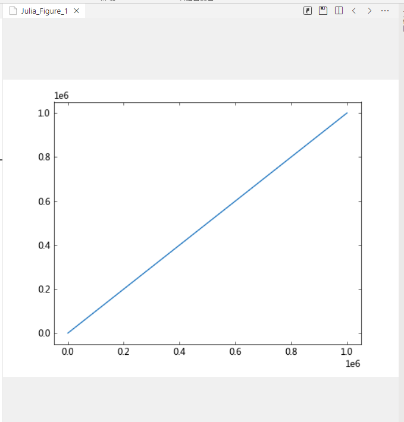

传递代码到 Syslab 执行，用于需要 Syslab 运行计算自定义代码的场景。
### 示例代码
#### 调用 Syslab 交互式绘图演示
1. 编辑 Julia 代码
```js
let code = `
    using TyPlot

    # 生成百万个数据点
    n = 1_000_000
    x = collect(1:n)
    y = collect(1:n)
    # 创建线图
    plot(x, y)
`
```
2. 传入 Syslab 唤起交互式绘图
```js
let message = await post({
  command: 'excute', // 
  code: code, // julia执行代码
})
```
3. 执行效果  


:::info 信息
是的，到这里想必你已经发现，在 Syslab 通过代码可以唤起与执行的操作，在 Errantia App 你都可以通过 `excute` 实现。
:::