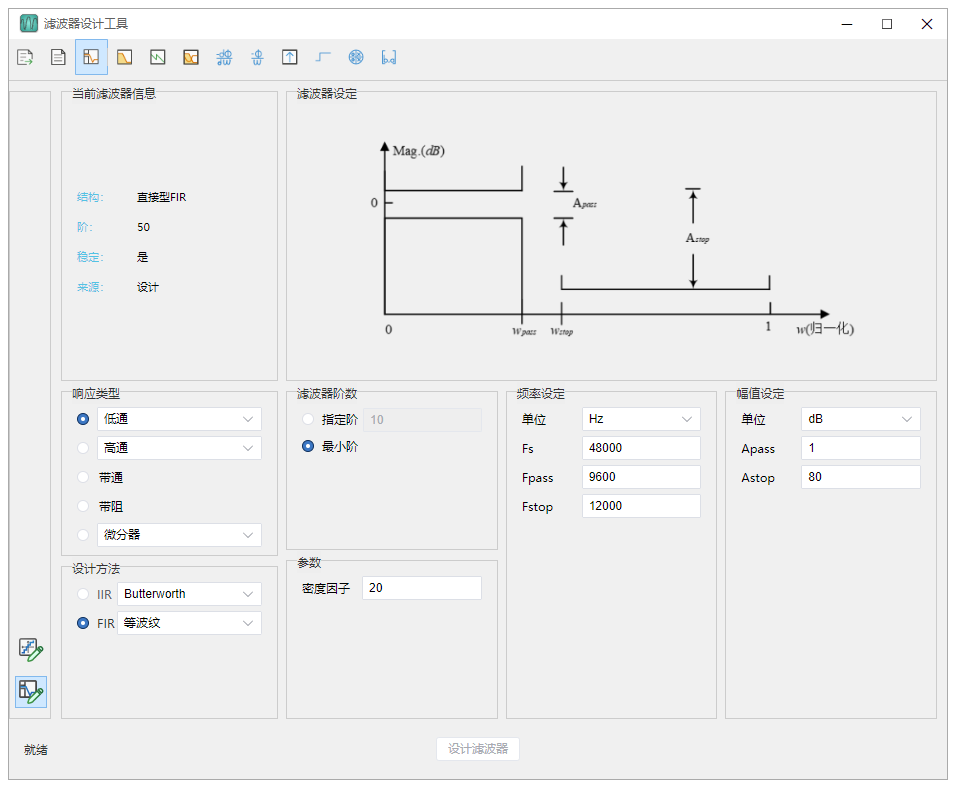
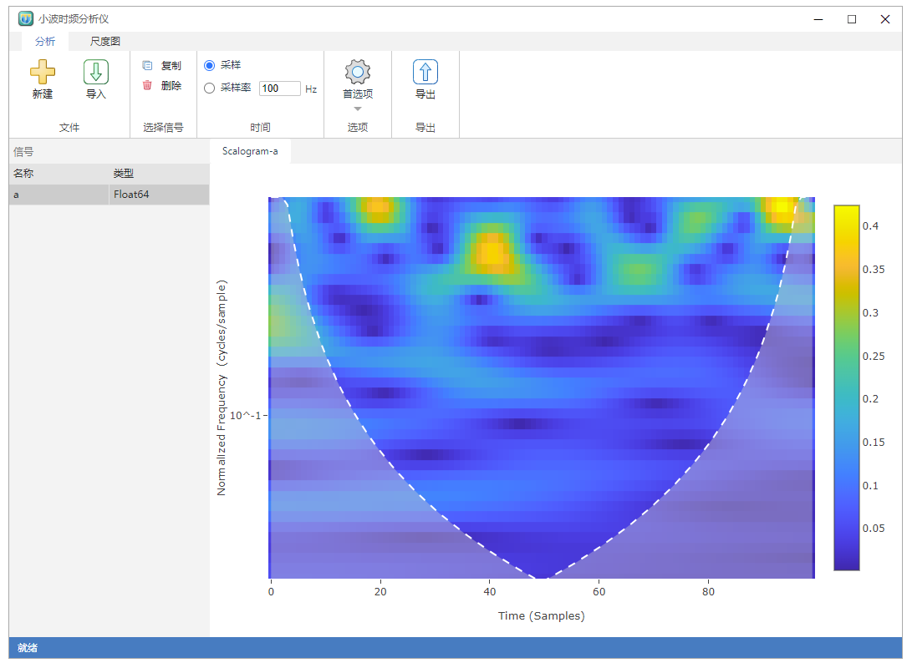
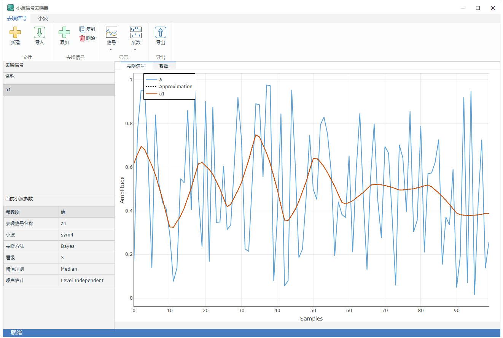
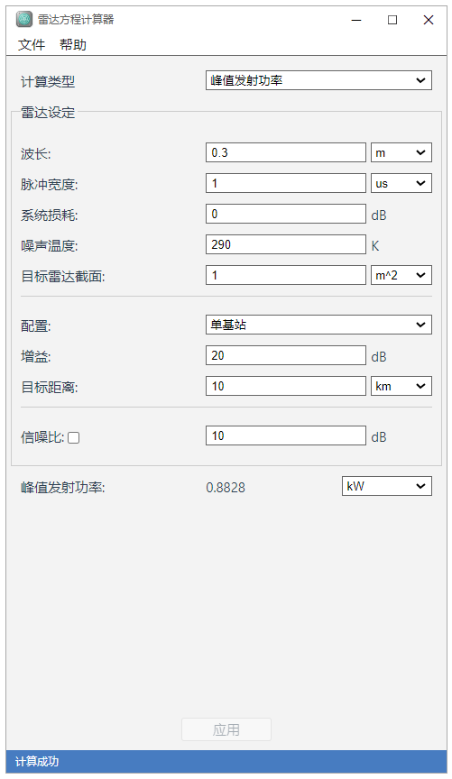
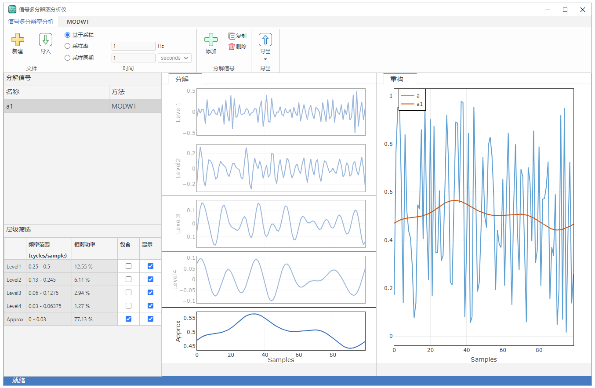
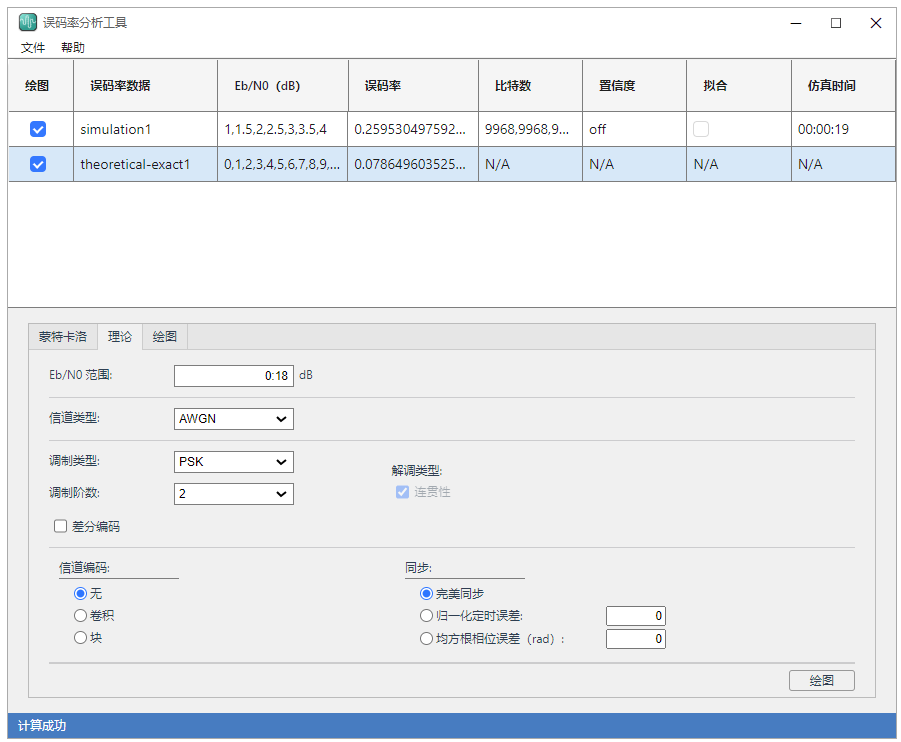

如果你想要找的是开源的可参考代码案例，点击 [Errantia 资源合集](/)
## Syslab App 应用
### 滤波器设计工具
 
* 名称: 滤波器设计工具
* 框架: Vue3
### 小波时频分析仪

* 名称: 小波时频分析仪
* 框架：Vue3
* UI: [Errantia 组件库](../module/about/introduce.md)
### 小波信号去噪器

* 名称: 小波信号去噪器
* 框架: Vue3
* UI: [Errantia 组件库](../module/about/introduce.md)
### 雷达方程计算器

* 名称: 雷达方程计算器
* 框架: React
### 信号多分辨率分析仪

* 名称: 信号多分辨率分析仪
* 框架: Vue3
* UI: [Errantia 组件库](../module/about/introduce.md)
### 误码率分析工具

* 名称: 误码率分析工具
* 框架: Vue3
* UI: [Errantia 组件库](../module/about/introduce.md)