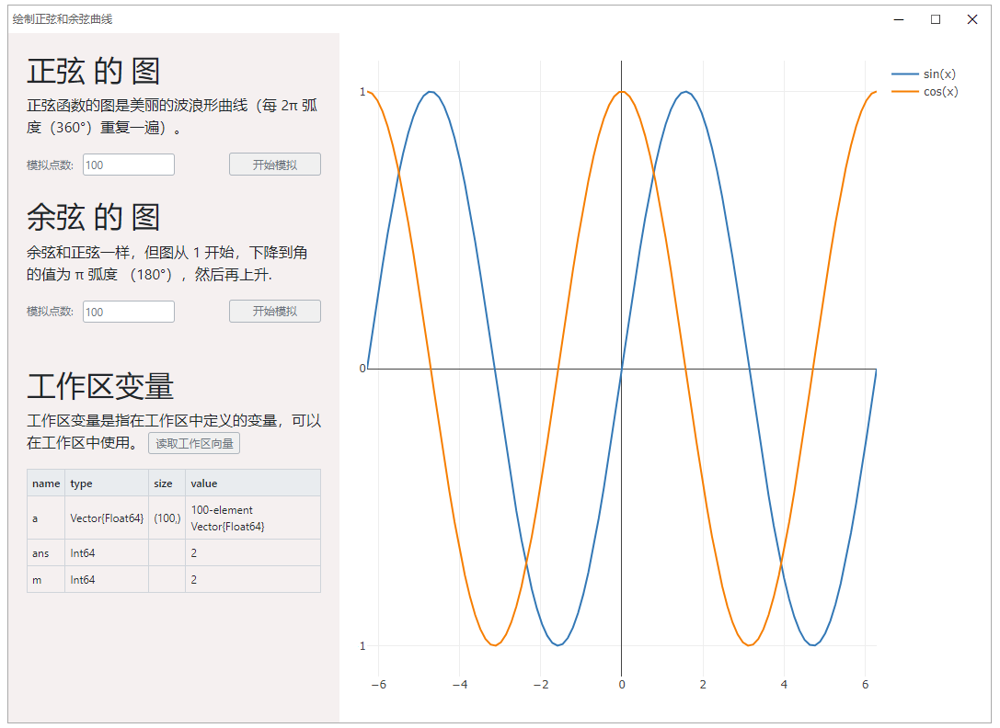
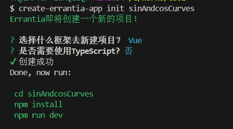
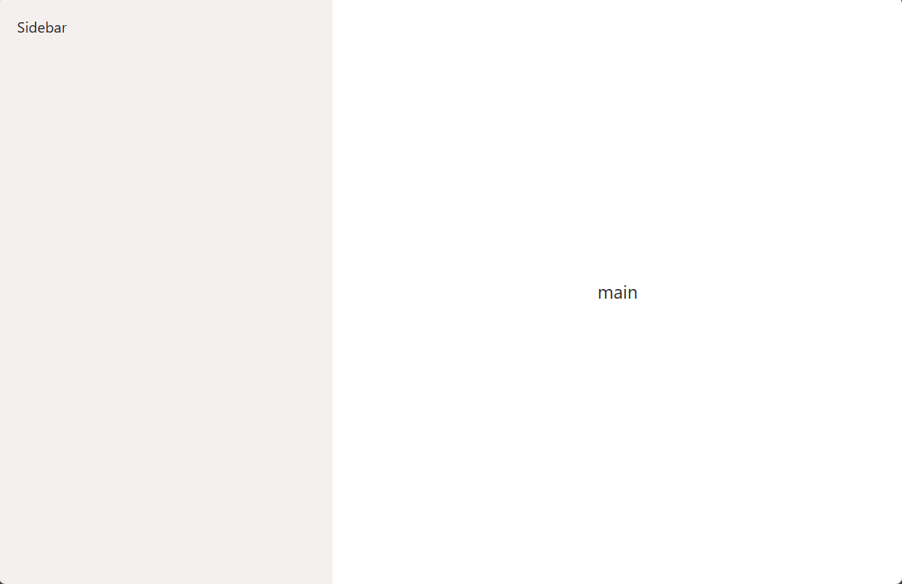
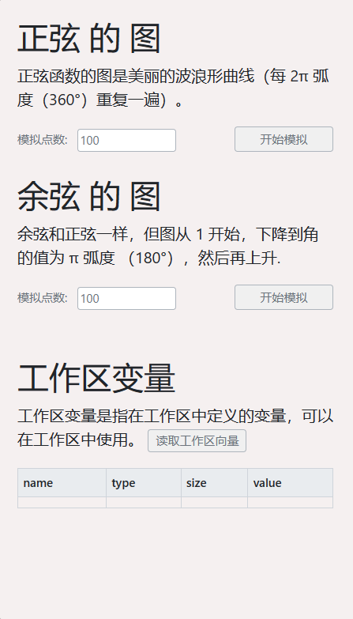
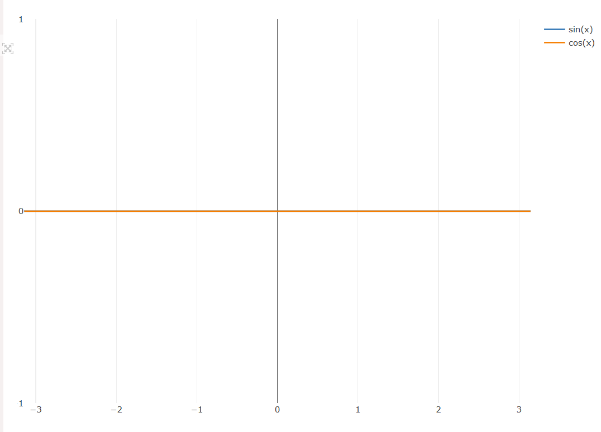
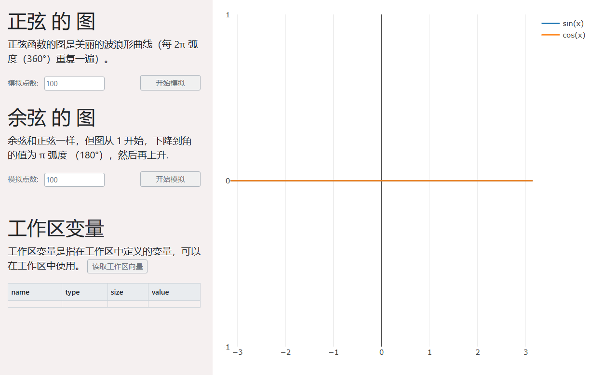
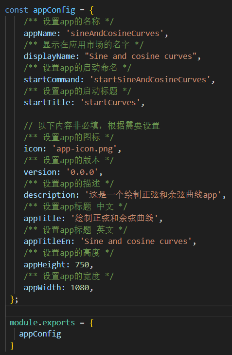
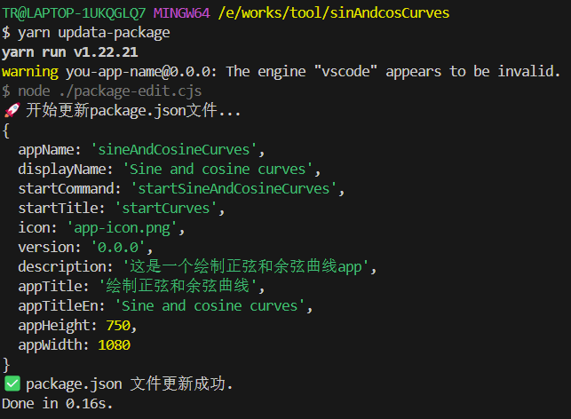
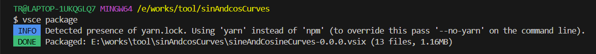
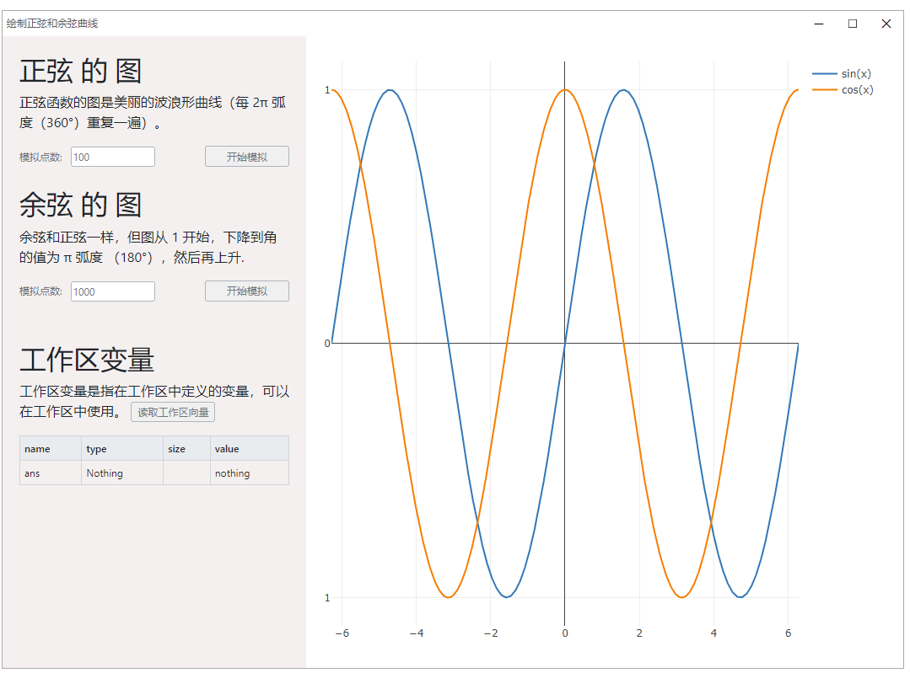

应用类型：Syslab App应用  
特征:
* 应用 Errantia 组件库
* 读取 Syslab 平台变量
* Syslab 运行 app 代码
* 可视化科学计算绘图
## 在我们开始之前
我们将在这个教程开发一个简单的 绘制正弦和余弦曲线应用，你将在本节教程学到 Errantia 的基础知识、概念和部分优化技巧。  
学习这些知识并不需要事先了解 Errantia、Web或Syslab App开发。  
当你掌握这些知识之后，你应该可以快速高效地开发Syslab App应用。  
## 实现效果


## 实现步骤
### 步骤一：创建正弦和余弦曲线应用项目

#### step1：安装 Errantia CLI
```bash
$ npm i create-errantia-app -g
```
#### step2：创建正弦和余弦曲线应用
```bash
$ create-errantia-app init sinAndcosCurves  
```
  
我们选择：vue + js 模板, 创建成功安装依赖并启动
```bash
$ cd sinAndcosCurves
$ yarn
$ yarn dev
```
### 步骤二：拆分模块开发
#### step1：两栏主界面实现
1. 结果展示

2. 构建页面结构
<details>
  <summary>代码</summary>
```html
<template>
 <erLayout :outStyleHeader="{height:'0px'}" :outStyleLeftSidebar="{width:'360px', backgroundColor: '#f5f0f0' }">
    <template #leftSidebar>
      <div class="Sidebar">Sidebar</div>
    </template>
    <template #main>
      <div class="main">main</div>
    </template>
  </erLayout>
</template>
<script setup>
  import { erLayout } from 'errantia'
</script>
<style scoped>
  .Sidebar{
    padding: 20px;
  }
  .main{
    height: 100vh;
    padding: 20px;
    display: flex;
    justify-content: center;
    align-items: center;
    font-size: 20px;
    color: #333;
    background-color: white;
  }
</style>
```
</details>

#### step2：侧边栏模块实现
1. 结果展示  

2. 构建页面结构
<details>
  <summary>代码</summary>
  ```html
  <template>
     <template #leftSidebar>
      <div class="Sidebar">
        <h2>正弦 的 图</h2>
        <p>正弦函数的图是美丽的波浪形曲线（每 2π 弧度（360°）重复一遍）。</p>
        <erFlex justify="space-between">
          <erFormItem label="模拟点数:" >
            <erInput :val="rangeSin" @onChangeValue="rangeSin = $event" />
          </erFormItem>
          <erInput 
            type="button" 
            val="开始模拟"
            @Click="handleSimulateClick('sin')"
          />
        </erFlex>
        <br/>
        <h2>余弦 的 图</h2>
        <p>余弦和正弦一样，但图从 1 开始，下降到角的值为 π 弧度 （180°），然后再上升.</p>
        <erFlex justify="space-between">
          <erFormItem label="模拟点数:" >
            <erInput :val="range" @onChangeValue="range = $event" />
          </erFormItem>
          <erInput 
            type="button" 
            val="开始模拟"
            @Click="handleSimulateClick('cos')"
          />
        </erFlex>
        <br/>
        <br/>
        <h2>工作区变量</h2>
        <p>
          工作区变量是指在工作区中定义的变量，可以在工作区中使用。  
          <erInput 
            type="button" 
            val="读取工作区向量"
            @Click="handGetWorkSpace"
          />
        </p>
        <div style="height: 200px; overflow-y: auto;">
          <erTable
            borders
            activeClickRow
            :outStyleHeader="{position: 'sticky', top: '0px'}"
            :columns="[
              {title: 'name', key: 'fullname'},
              {title: 'type', key: 'type'},
              {title: 'size', key: 'size'},
              {title: 'value', key: 'value'},
            ]"
            :dataSource="Variables"
          />
        </div>
      </div>
    </template>
  </template>
  <script setup>
    import { ref } from 'vue'
    import { erLayout, erPlot, erFormItem, erInput, erFlex, erTable } from 'errantia'
    import { onMounted } from 'vue';
    import { useConnectSyslabCenter } from './hooks/useConnectSyslabCenter';
    const { initFilePath, getSinCos, getWorkspaceVariables } = useConnectSyslabCenter()
    onMounted(async () => {
      await initFilePath()
    })
    const data = ref([])
    // 模拟cos点数
    const range = ref(100)
    // 模拟sin点数
    const rangeSin = ref(100)
    // 模拟点击事件
    const handleSimulateClick = async (type) => {
      let rangeVal = type === 'sin' ? rangeSin.value : range.value
      const res = await getSinCos(type, rangeVal)
      if(type === 'sin' && res.x && res.y){
        data.value[0].x = res.x
        data.value[0].y = res.y
      }
      if(type === 'cos' && res.x && res.y){
        data.value[1].x = res.x
        data.value[1].y = res.y
      }
    }
    // 工作区向量
    const Variables = ref([{}])
    // 获取工作区向量
    const handGetWorkSpace = async () => {
      const res = await getWorkspaceVariables()
      if(res && res.length){
        // 过滤掉canShow为false的变量
        let result = res.filter((item) => !!item.type) 
        if(!result.length) result = [{}]
        Variables.value = result
      }
    }
</script>
  ```
</details>

#### step3：绘图模块实现
1. 结果展示

<details>
  <summary>数据结构</summary>
  ```js
  // 图表数据
  const x = [-Math.PI, -Math.PI / 2, 0, Math.PI / 2, Math.PI];
  const y = [0, 0, 0, 0, 0];
  const data = ref([
    {
      name: 'sin(x)',
      x: x,
      y: y,
      mode: 'lines',
      type: 'scatter'
    },
    {
      name: 'cos(x)',
      x: x,
      y: y,
      mode: 'lines',
      type: 'scatter'
    }
  ])
  const layout = ref({
    xaxis: {
      zeroline: true,
      showline: false,
      mirror: false,
    },
    yaxis: {
      zeroline: true,
      showline: false,
      mirror: false,
      tickmode: 'linear', // 设置刻度模式为线性
      tick0: 0, // 设置刻度起始值
      dtick: 1, // 设置刻度间隔为 1
    }
  })
  ```
</details>

3. 构建页面结构
<details>
  <summary>代码</summary>
  ```html
  <template>
    <erPlot
      :dataSource="data"
      :layout="layout"
    />
  </template>
  ```
</details>


#### step4：Syslab 通信hooks实现
1.通信hooks文件添加读取工作区变量和执行正余弦代码 
<details>
  <summary>代码</summary>
  ```js
  import { post } from '../request/connectBase'
  import { ref } from 'vue'

  // 传递给 Syslab 需要执行的Julia代码
  const getSinCosJulia = (appFilePath, type, range) => {
    const func = type === 'sin' ? 'sin' : 'cos'
    return `
    let
        # 生成 x 值
        x = LinRange(-2π, 2π, ${range})
        # 计算正弦和余弦值
        y = ${func}.(x)
        ret = Dict("x" => x, "y" => y)
        using JSON
        output_text = JSON.json(ret)
        io = open("${appFilePath}","w")
        write(io,output_text)
        close(io)
    end
    `
  }

  // syslab读取临时文件路径
  const appFilePath = ref('')
  export const useConnectSyslabCenter = () => {
    
    // 初始化临时文件路径
    const initFilePath = async () => {
      let message = await post({
        key: 'filePath',
        command: 'getFilePath'
      })
      appFilePath.value = message.data?.value ?? ''
      return message.data ?? ''
    }

    // 模拟正余弦曲线
    const getSinCos = async (type, range) => {
      let message = await post({
        key: 'getSinCos',
        command: 'excute',
        code: getSinCosJulia(appFilePath.value, type, range),
        filePath: appFilePath.value 
      })
      return message.data?.value ?? {}
    }

    // 获取工作区变量列表
    const getWorkspaceVariables = async () => {
      let message = await post({
        key: 'checkVar',
        command: 'getWorkspaceVariables',
        filePath: appFilePath.value,
      })
      return message.data?.value ?? {}
    }

    return {
      initFilePath,
      getSinCos,
      getWorkspaceVariables
    }
  }
  ```
</details>

### 步骤三：组装模块合并

##### 完成演示

##### 全部代码
<details>
  <summary>代码</summary>
  ```html
  <script setup>
    import { ref } from 'vue'
    import { erLayout, erPlot, erFormItem, erInput, erFlex, erTable } from 'errantia'
    import { onMounted } from 'vue';
    import { useConnectSyslabCenter } from './hooks/useConnectSyslabCenter';

    const { initFilePath, getSinCos, getWorkspaceVariables } = useConnectSyslabCenter()
    onMounted(async () => {
      await initFilePath()
    })
    const x = [-Math.PI, -Math.PI / 2, 0, Math.PI / 2, Math.PI];
    const y = [0, 0, 0, 0, 0];

    const data = ref([
      {
        name: 'sin(x)',
        x: x,
        y: y,
        mode: 'lines',
        type: 'scatter'
      },
      {
        name: 'cos(x)',
        x: x,
        y: y,
        mode: 'lines',
        type: 'scatter'
      }
    ])
    const layout = ref({
      xaxis: {
        zeroline: true,
        showline: false,
        mirror: false,
      },
      yaxis: {
        zeroline: true,
        showline: false,
        mirror: false,
        tickmode: 'linear', // 设置刻度模式为线性
        tick0: 0, // 设置刻度起始值
        dtick: 1, // 设置刻度间隔为 1
      }
    })
    // 模拟cos点数
    const range = ref(100)
    // 模拟sin点数
    const rangeSin = ref(100)
    // 模拟点击事件
    const handleSimulateClick = async (type) => {
      let rangeVal = type === 'sin' ? rangeSin.value : range.value
      const res = await getSinCos(type, rangeVal)
      if(type === 'sin' && res.x && res.y){
        data.value[0].x = res.x
        data.value[0].y = res.y
      }
      if(type === 'cos' && res.x && res.y){
        data.value[1].x = res.x
        data.value[1].y = res.y
      }
    }
    // 工作区向量
    const Variables = ref([{}])
    // 获取工作区向量
    const handGetWorkSpace = async () => {
      const res = await getWorkspaceVariables()
      if(res && res.length){
        // 过滤掉canShow为false的变量
        let result = res.filter((item) => !!item.type) 
        if(!result.length) result = [{}]
        Variables.value = result
      }
    }
  </script>

  <template>
      <erLayout :outStyleHeader="{height:'0px'}" :outStyleLeftSidebar="{width:'360px', backgroundColor: '#f5f0f0' }">
        <template #leftSidebar>
          <div class="Sidebar">
            <h2>正弦 的 图</h2>
            <p>正弦函数的图是美丽的波浪形曲线（每 2π 弧度（360°）重复一遍）。</p>
            <erFlex justify="space-between">
              <erFormItem label="模拟点数:" >
                <erInput :val="rangeSin" @onChangeValue="rangeSin = $event" />
              </erFormItem>
              <erInput 
                type="button" 
                val="开始模拟"
                @Click="handleSimulateClick('sin')"
              />
            </erFlex>
            <br/>
            <h2>余弦 的 图</h2>
            <p>余弦和正弦一样，但图从 1 开始，下降到角的值为 π 弧度 （180°），然后再上升.</p>
            <erFlex justify="space-between">
              <erFormItem label="模拟点数:" >
                <erInput :val="range" @onChangeValue="range = $event" />
              </erFormItem>
              <erInput 
                type="button" 
                val="开始模拟"
                @Click="handleSimulateClick('cos')"
              />
            </erFlex>
            <br/>
            <br/>
            <h2>工作区变量</h2>
            <p>
              工作区变量是指在工作区中定义的变量，可以在工作区中使用。  
              <erInput 
                type="button" 
                val="读取工作区向量"
                @Click="handGetWorkSpace"
              />
            </p>
          
            <div style="height: 200px; overflow-y: auto;">
              <erTable
                borders
                activeClickRow
                :outStyleHeader="{position: 'sticky', top: '0px'}"
                :columns="[
                  {title: 'name', key: 'fullname'},
                  {title: 'type', key: 'type'},
                  {title: 'size', key: 'size'},
                  {title: 'value', key: 'value'},
                ]"
                :dataSource="Variables"
              />
            </div>
          </div>
        </template>
        <template #main>
          <div class="main">
            <erPlot 
              :dataSource="data"
              :layout="layout"
            />
          </div>
        </template>
      </erLayout>
  </template>

  <style scoped>
    .Sidebar{
      padding: 20px;
    }
    .main{
      height: 100vh;
      padding: 20px;
      display: flex;
      justify-content: center;
      align-items: center;
      font-size: 20px;
      color: #333;
      background-color: white;
    }
  </style>
  ```
</details>

### 步骤四: 上传Syslab 
1. 编辑 Syslab App 启动命名和配置信息  
   
* 同步配置信息
  ```bash
  $ yarn updata-package
  ``` 
     
2. 打包上传并查看效果
  * 打包/更新`dist`文件目录
  ```bash
  $ yarn build
  ```
  * 打包为`.vsix`
  ```bash
  $ vsce package
  ```
     
  * 上传 Syslab online 查看效果
     

更多[安装及使用](../../plug_app/quick_start/installUse)


