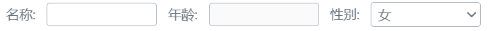

### 何时使用
用于控制一个实体或收集信息排列方式。
### 代码演示
#### 水平排列方式

<details>
  <summary>代码</summary>
  ```html
  <template>
    <erFlex :outStyleFlex="{gap:'10px'}">
      <erFormItem label="名称:" >
        <erInput @onChangeValue="console.log('i', $event)"/>
      </erFormItem>
      <erFormItem label="年龄:" >
        <erInput 
          disabled 
          type="number" 
          @onChangeValue="console.log('i', $event)"
        />
      </erFormItem>
      <erFormItem label="性别:" >
        <erSelect 
          :value="'女'" 
          :optionList="[{value: '女'}, {value: '男'}]"
          @onChangeValue="console.log('s', $event)" 
        />
      </erFormItem>
    </erFlex>
  </template>
  ```
</details>

#### 垂直排列方式 

<details>
  <summary>代码</summary>
  ```html
  <template>
    <erFlex vertical :outStyleFlex="{gap:'10px'}">
      <erFormItem vertical label="名称:" >
        <erInput disabled @onChangeValue="console.log('i', $event)"/>
      </erFormItem>
      <erFormItem vertical label="年龄:" >
        <erInput type="number" @onChangeValue="console.log('i', $event)"/>
      </erFormItem>
      <erFormItem vertical label="性别:" >
        <erSelect 
          :value="'女'" 
          :optionList="[{value: '女'}, {value: '男'}]"
          @onChangeValue="console.log('s', $event)" 
        />
      </erFormItem>
    </erFlex>
  </template>
  ```
</details>

### API
### Attributes
|属性名|说明|类型|默认值|
|:------|:------|:------|:------|
|label|表单label|string|名称:|
|vertical|是否垂直排列|boolean|false|
|outStyleFormItem|最外层容器样式|Object|—|
|outStyleLable|label样式|object|—|
|outStyleContent|默认插槽内容容器样式|object|—|
