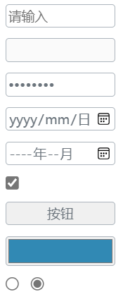

### 何时使用
需要用户输入表单域内容时。
### 代码演示
#### 基本用法

<details>
  <summary>代码</summary>
  ```html
  <template>
    <erFlex vertical :outStyleFlex="{gap:'10px'}">
      <erInput
        placeholder="请输入"
        @change="console.log('2', $event)"
        @onChangeValue="console.log('i', $event)"
      />
      <erInput 
        disabled 
        type="number" 
        @onChangeValue="console.log('i', $event)"
      />
      <erInput 
        type="password"
        @onChangeValue="console.log('i', $event)"
      />
      <erInput 
        type="date"
        @onChangeValue="console.log('i', $event)"
      />
      <erInput 
        type="month"
        @onChangeValue="console.log('i', $event)"
      />
      <erInput 
        type="checkbox"
        @onChangeValue="console.log('i', $event)"
      />
      <erInput 
        type="button"
        val="按钮"
        @Click="console.log('i', $event)"
      />
      <erInput 
        type="color"
        @onChangeValue="console.log('i', $event)"
      />
      <erFlex :outStyleFlex="{gap:'10px'}">
        <erInput 
          type="radio"
          value="1"
          :val="radioVal"
          @onChangeValue="val = $event"
        />
        <erInput 
          type="radio"
          value="2"
          :val="radioVal"
          @onChangeValue="val = $event"
        />
      </erFlex>
    </erFlex>
  </template>
  <script setup lang="ts">
    import { ref } from 'vue'
    const radioVal = ref('2')
  </script>
  ```
</details>

### API
### Attributes
|属性名|说明|类型|默认值|
|:------|:------|:------|:------|
|type|类型|string, 参考[原生input类型](https://developer.mozilla.org/en-US/docs/Web/HTML/Element/input#Form_%3Cinput%3E_types)|text|
|disabled|是否禁止输入|boolean|false|
|val|绑定的受控值|any|—|
|outStyleInput|input样式|object|—|

:::tip 提示
**erInput**完美兼容原生的input的所有属性和事件，你可以在**erInput**上自主配置，  
 例如：`placeholder`、`change`
:::

### Events
|事件名|说明|类型|
|:------|:------|:------|
|@onChangeValue|输入值改变，同步绑定的受控值val事件|Function|
|@change|仅当**输入框值**改变时，当输入框失去焦点或用户按Enter时触发|Function|
|@blur|当选择器的输入框失去焦点时触发|Function|
|@xxx|其它原生input事件|Function|

