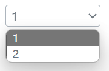

### 何时使用
需要用户输入表单域内容时。
### 代码演示
#### 基本用法

<details>
  <summary>代码</summary>
  ```html
  <template>
    <erSelect 
      :val="val" 
      :optionList="[{value: '1'}, {value: '2'}]"
      @onChangeValue="console.log('onChangeValue', $event)" 
    />
  </template>
  ```
</details>

### API
### Attributes
|属性名|说明|类型|默认值|
|:------|:------|:------|:------|
|disabled|是否禁止输入|boolean|false|
|val|当前选择值|string或number|—|
|optionList|选择值列表|array，必须包含value属性值|—|
|outStyleSelect|select样式|object|—|

### Events
|事件名|说明|类型|
|:------|:------|:------|
|@onChangeValue|选择值改变，同步绑定的受控值val事件|Function|
