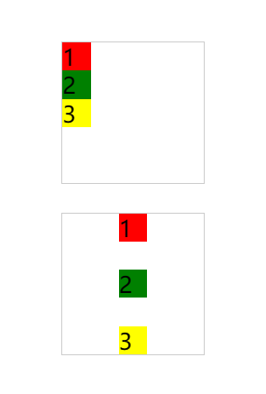

### 何时使用
- 适合设置元素之间的间距。
- 适合设置各种水平、垂直对齐方式。

### 代码演示

import Tabs from '@theme/Tabs';
import TabItem from '@theme/TabItem';

<Tabs>
  <TabItem value="npm" label="horizontal" default>
    
    <details>
      <summary>代码</summary>
      ```html
      <template>
          <erFlex justify="center" aligns="center" :outStyleFlex="{height: '100vh', gap: '20px'}" >
            <div style="width: 100px; height: 100px; border: 1px solid #ccc;">
              <erFlex>
                <div style="width: 20px; height: 20px; background-color: red;">1</div>
                <div style="width: 20px; height: 20px; background-color: green;">2</div>
                <div style="width: 20px; height: 20px; background-color: yellow;">3</div>
              </erFlex>
            </div>
            <div style="width: 100px; height: 100px; border: 1px solid #ccc;">
              <erFlex 
                justify="space-between" 
                aligns="center" 
              >
                <div style="width: 20px; height: 20px; background-color: red;">1</div>
                <div style="width: 20px; height: 20px; background-color: green;">2</div>
                <div style="width: 20px; height: 20px; background-color: yellow;">3</div>
              </erFlex>
            </div>
          </erFlex>
      </template>
      ```
    </details>
  </TabItem>
  <TabItem value="yarn" label="vertical">
    
    <details>
      <summary>代码</summary>
      ```html
      <template>
        <erFlex vertical justify="center" aligns="center" :outStyleFlex="{height: '100vh', gap: '20px'}" >
          <div style="width: 100px; height: 100px; border: 1px solid #ccc;">
            <erFlex vertical>
              <div style="width: 20px; height: 20px; background-color: red;">1</div>
              <div style="width: 20px; height: 20px; background-color: green;">2</div>
              <div style="width: 20px; height: 20px; background-color: yellow;">3</div>
            </erFlex>
          </div>
          <div style="width: 100px; height: 100px; border: 1px solid #ccc;">
            <erFlex 
              vertical
              justify="space-between" 
              aligns="center" 
            >
              <div style="width: 20px; height: 20px; background-color: red;">1</div>
              <div style="width: 20px; height: 20px; background-color: green;">2</div>
              <div style="width: 20px; height: 20px; background-color: yellow;">3</div>
            </erFlex>
          </div>
        </erFlex>
      </template>
      ```
    </details>
  </TabItem>
</Tabs>

### API
:::note 备注
自`errantia@0.x`版本开始提供改组件，**Flex 组件**默认行为在水平模式下，为向上对齐，在垂直模式下，为向右对齐，你可以通过属性进行调整。
:::
### Attributes
|属性名|说明|类型|默认值|
|:------|:------|:------|:------|
|vertical|flex 主轴的方向是否垂直，使用 flex-direction: column|boolean|false|
|justify|设置元素在主轴方向上的对齐方式|参考 [justify-content](https://developer.mozilla.org/zh-CN/docs/Web/CSS/justify-content)|normal|
|align|设置元素在交叉轴方向上的对齐方式|参考 [align-items](https://developer.mozilla.org/zh-CN/docs/Web/CSS/align-items)|normal|
|outStyleFlex|自定义元素样式|Object|—|
