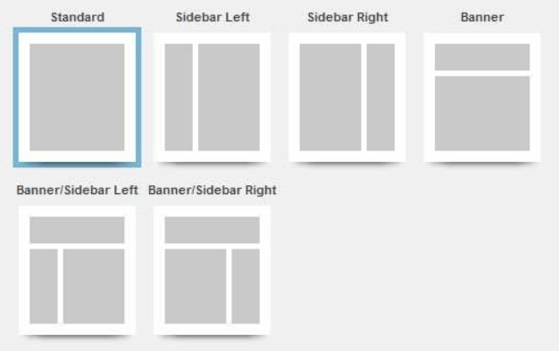
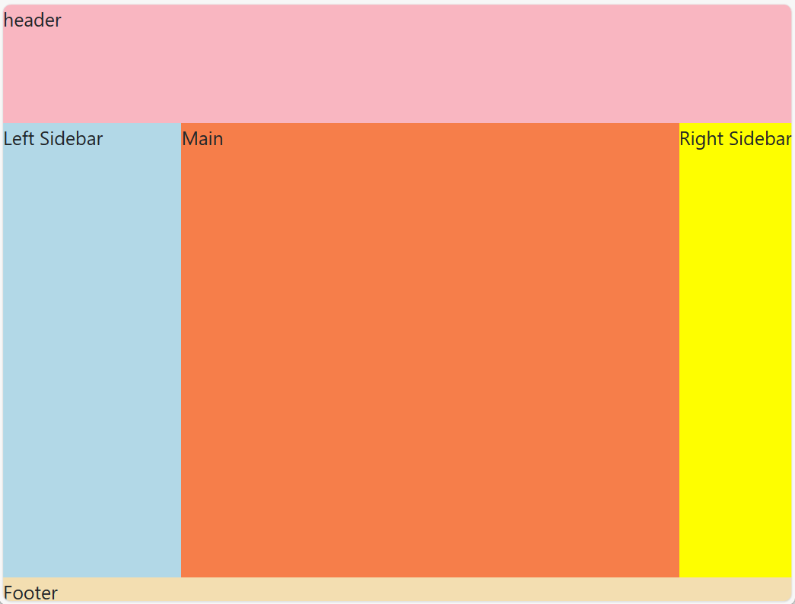
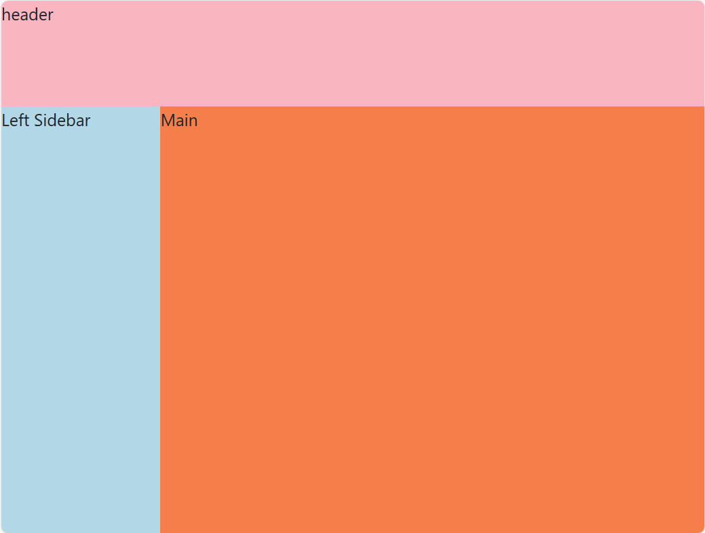
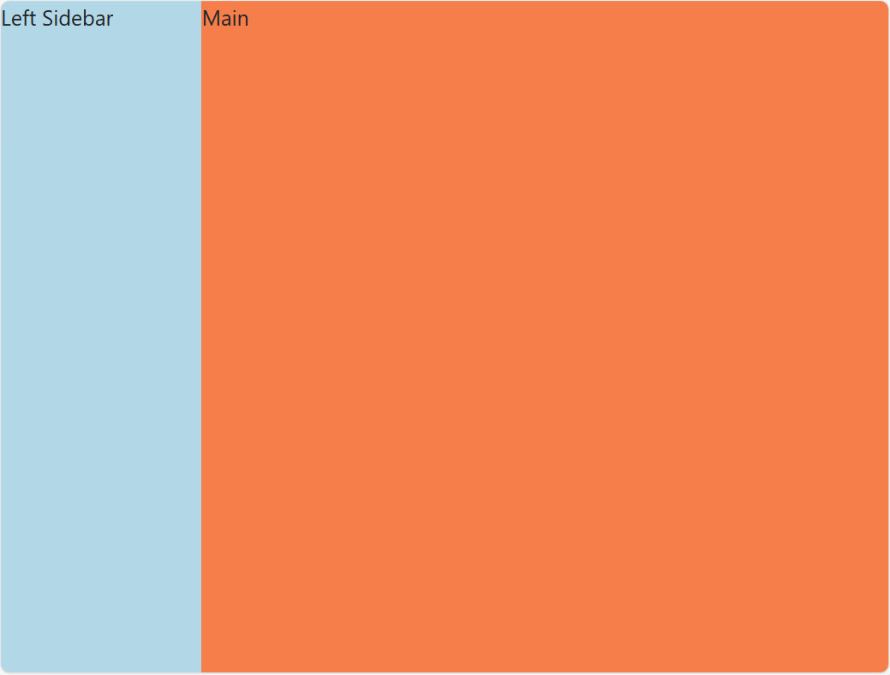

### 何时使用
页面布局是样式开发的第一步，也是 CSS 最重要的功能之一。
- 适合app主界面响应式布局;
- 适合快速搭建各种页面布局。  



### 代码演示
#### 圣杯布局

<details>
  <summary>代码</summary>
  ```html
  <template>
    <erLayout>
      <template #header>
        <div>header</div>
      </template>
      <template #leftSidebar>
        <div>Left Sidebar</div>
      </template>
      <template #main>
        <div>Main</div>
      </template>
      <template #rightSidebar>
        <div>Right Sidebar</div>
      </template>
      <template #footer>
        <div>Footer</div>
      </template>
    </erLayout>
  </template>
  ```
</details>

#### 三栏式布局

<details>
  <summary>代码</summary>
  ```html
  <template>
    <erLayout>
      <template #header>
        <div>header</div>
      </template>
      <template #leftSidebar>
        <div>Left Sidebar</div>
      </template>
      <template #main>
        <div>Main</div>
      </template>
    </erLayout>
  </template>
  ```
</details>

#### 二栏式布局

<details>
  <summary>代码</summary>
  ```html
  <template>
   <erLayout :outStyleHeader="{height:'0px'}">
      <template #leftSidebar>
        <div>Left Sidebar</div>
      </template>
      <template #main>
        <div>Main</div>
      </template>
    </erLayout>
  </template>
  ```
</details>

### API
### Attributes
|属性名|说明|类型|默认值|
|:------|:------|:------|:------|
|showLeftSidebar|是否显示左边栏|boolean|true|
|showRightSidebar|是否显示右边栏|boolean|false|
|showFooter|是否显页脚|boolean|false|
|outStyleHeader|自定义页眉元素样式|Object|—|
|outStyleLeftSidebar|自定义左边栏元素样式|Object|—|
|outStyleMain|自定义主栏元素样式|Object|—|
|outStyleRightSidebar|自定义右边栏元素样式|Object|—|
|outStyleFooter|自定义页脚元素样式|Object|—|

### Slots
|插槽名|说明|
|:------|:------|
|header|自定义页眉区域|
|leftSidebar|自定义左边栏区域|
|main|自定义主栏区域|
|rightSidebar|自定义右边栏区域|
|footer|自定义页脚区域|
