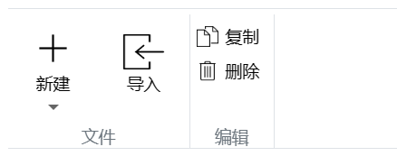

### 何时使用
功能菜单栏是工业网站的灵魂，用户依赖在菜单栏中进行各个菜单项操作。
- 适合快速构建菜单区。

### 代码演示

<details>
  <summary>代码</summary>
  ```html
  <template>
    <erMenuBar>
      <erMenuItem title="文件">
        <erPicText
          hasSubscript
          iconPath="https://img.icons8.com/ios/452/plus-math.png"
          title="新建"
        />
        <erPicText
          :outStyleIcon="{width: '30px', height: '25px', marginTop: '5px'}"
          iconPath="https://img.icons8.com/ios/452/import.png"
          title="导入"
        />
      </erMenuItem>
      <erMenuItem title="编辑">
        <erFlex vertical>
        <erPicText
            horizontal
            iconPath="https://img.icons8.com/ios/452/copy.png"
            :outStyleIcon="{width: '15px', height: '15px', marginRight: '5px'}"
            title="复制"
          />
          <erPicText
            horizontal
            iconPath="https://img.icons8.com/ios/452/delete.png"
            :outStyleIcon="{width: '15px', height: '15px', marginRight: '5px'}"
            title="删除"
          />
        </erFlex>
      </erMenuItem>
    </erMenuBar>
  </template>
  ```
</details>

### API
### erMenuBar Attributes
|属性名|说明|类型|默认值|
|:------|:------|:------|:------|
|outStyleMenuBar|自定义菜单栏组件最外层元素样式|Object|—|

### erMenuItem Attributes
|属性名|说明|类型|默认值|
|:------|:------|:------|:------|
|title|菜单项内容名称|string|—|
|outStyleSection|自定菜单项内容元素样式|Object|—|
|outStyleContent|自定义默认插槽内容元素样式|Object|—|
|outStyleTitle|自定义菜单项内容名称元素样式|Object|—|

