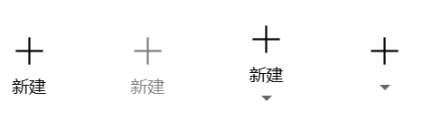
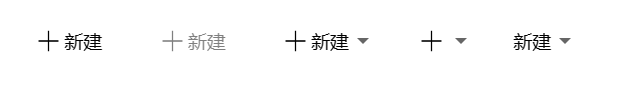

### 何时使用
- 适合图形元素与文字组合展示的场景，例如：菜单项、头像、图像标题、折叠展开‧‧‧。
- 适合设置各种水平、垂直图文组合方式。

### 代码演示
#### 默认垂直方式

<details>
  <summary>代码</summary>
  ```html
  <template>
    <erPicText
      iconPath="https://img.icons8.com/ios/452/plus-math.png"
      title="新建"
      @onAction="handleAction"
      @onContextMenu="onContextMenu"
    />
    <erPicText
      disabled
      iconPath="https://img.icons8.com/ios/452/plus-math.png"
      title="新建"
    />
    <erPicText
      hasSubscript
      iconPath="https://img.icons8.com/ios/452/plus-math.png"
      title="新建"
    />
    <erPicText
      hasSubscript
      iconPath="https://img.icons8.com/ios/452/plus-math.png"
    />
  </template>
  ```
</details>

#### 设置水平方式

<details>
  <summary>代码</summary>
  ```html
  <template>
    <erPicText
      horizontal
      iconPath="https://img.icons8.com/ios/452/plus-math.png"
      title="新建"
      @onAction="handleAction"
      @onContextMenu="onContextMenu"
    />
    <erPicText
      horizontal
      disabled
      iconPath="https://img.icons8.com/ios/452/plus-math.png"
      title="新建"
    />
    <erPicText
      horizontal
      hasSubscript
      iconPath="https://img.icons8.com/ios/452/plus-math.png"
      title="新建"
    />
    <erPicText
      horizontal
      hasSubscript
      iconPath="https://img.icons8.com/ios/452/plus-math.png"
    />
    <erPicText
      horizontal
      hasSubscript
      title="新建"
    />
  </template>
  ```
</details>

### API
### Attributes
|属性名|说明|类型|默认值|
|:------|:------|:------|:------|
|horizontal|flex 主轴的方向是否垂直，使用 flex-direction: row|boolean|false|
|disabled|是否禁用|boolean|false|
|iconPath|自定义前缀图标|string|—|
|title|自定义文本内容|string|—|
|outStylePicText|自定义组件最外层元素样式|Object|—|
|outStyleAction|自定义包裹图文元素样式|Object|—|
|outStyleIcon|自定义图形元素样式|Object|—|
|outStyleLable|自定义文本元素样式|Object|—|
|outStyleArrow|自定义折叠隐藏元素样式|Object|—|

### Events
|事件名|说明|类型|
|:------|:------|:------|
|@onAction|包裹图文元素的点击事件|Function|
|@onContextMenu|折叠菜单点击事件|Function|

### Slots
|插槽名|说明|
|:------|:------|
|customTitle|自定义文本内容|
|customSubscript|自定义折叠展开菜单区域|
