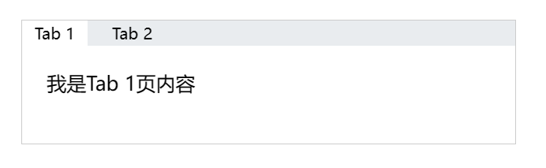

### 何时使用
提供平级的区域将大块内容进行收纳和展现，保持界面整洁。
- 适合水平点击切换隐藏展示多标签;
- 既可用于容器顶部，也可用于容器内部，是最通用的 Tabs。

### 代码演示

<details>
  <summary>代码</summary>
  ```html
  <template>
    <div style="width: 400px; height: 100px; border: 1px solid #ccc;">
      <erTabs 
        :tabList="tabList"
        :activateTab="activateTab"
        :outStyleContent="{padding: '20px'}"
        @onSwitchTab="handleSwitchTab"
      >
        <div 
          v-for="tab in tabList" 
          :key="tab.id" 
          v-show="activateTab === tab.id"
        >
          我是{{ tab.label }}页内容
        </div>
      </erTabs>
    </div>
  </template>

  <script setup lang="ts">
    import { ref } from 'vue'

    const activateTab = ref<Number>(0)
    const handleSwitchTab = (tab:any) => {
      activateTab.value = tab.id
      console.log(tab)
    }
    const tabList = [
      {id: 0, label: 'Tab 1'},
      {id: 1, label: 'Tab 2'},
    ]
  </script>
  ```
</details>

### API
### Attributes
|属性名|说明|类型|默认值|
|:------|:------|:------|:------|
|<a id='tabList'>tabList</a>|flex 主轴的方向是否垂直，使用 flex-direction: row|boolean|false|
|outStyleContainer|自定义组件最外层元素样式|Object|—|
|outStyleMenu|自定义标签栏元素样式|Object|—|
|outStyleItem|自定义各个标签元素样式|Object|—|
|outStyleContent|自定义标签内容元素样式|Object|—|

### Events
|事件名|说明|类型|
|:------|:------|:------|
|@onSwitchTab|切换标签点击事件, 返回当前标签的[tabList](#tabList)值为第一个参数.|Function|

### Slots
|插槽名|说明|
|:------|:------|
|—|`默认插槽:` 当前tabs标签的内容|
