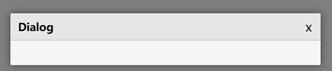
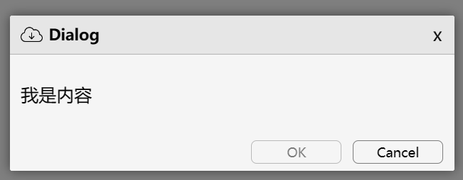

### 何时使用
需要用户处理事务，又不希望跳转页面以致打断工作流程时，可以使用 Dialog 在当前页面正中打开一个浮层，承载相应的操作。
### 代码演示
#### 基础使用

<details>
  <summary>代码</summary>
  ```html
  <template>
    <erDialog 
      title="Dialog"
      width="400px"
      :isVisible="true"
    />
  </template>
  ```
</details>

#### 复合使用

<details>
  <summary>代码</summary>
  ```html
  <template>
    <erDialog 
      title="Dialog"
      width="400px"
      :isVisible="true"
      okBtn="OK"
      disabledOK
      cancelBtn="Cancel"
      :outStyleBody="{padding: '10px'}"
      @close="console.log('close')"
      @onCancel="console.log('cancel')"
      @onConfirm="console.log('confirm')"
    >
      <template v-slot:icon>
        
      </template>
      <p>我是内容</p>
    </erDialog>
  </template>
  ```
</details>

### API
### Attributes
|属性名|说明|类型|默认值|
|:------|:------|:------|:------|
|title|弹窗标题|string|—|
|isVisible|是否显示弹窗|boolean|false|
|cancelBtn|取消按钮文字|string|—|
|okBtn|确定按钮文字|string|—|
|disabledOK|禁用确认按钮|boolean|false|
|disabledCancel|禁用取消按钮|boolean|false|
|cancelXIcon|取消关闭弹窗icon|boolean|false|
|outStyleMask|弹窗蒙层样式|Object|—|
|outStyleContent|弹窗整体内容样式|object|—|
|outStyleBody|弹窗内容样式|Object|—|

### Events
|事件名|说明|类型|
|:------|:------|:------|
|@close|关闭弹窗事件|Function|
|@confirm|确认按钮事件|Function|
|@cancel|取消按钮事件|Function|

### Slots
|插槽名|说明|
|:------|:------|
|—|`默认插槽:` Dialog的内容|
|icon|标题前自定义icon等内容插槽|