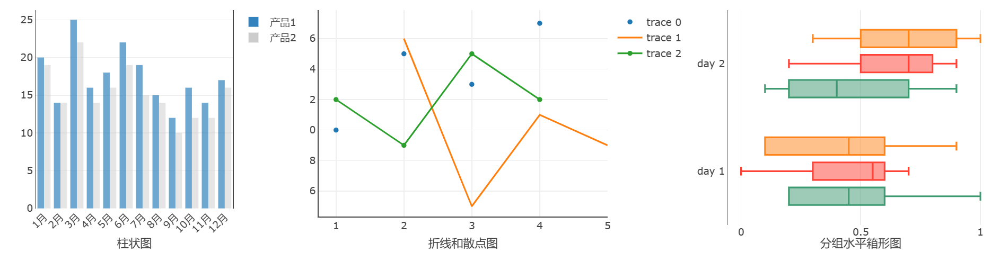
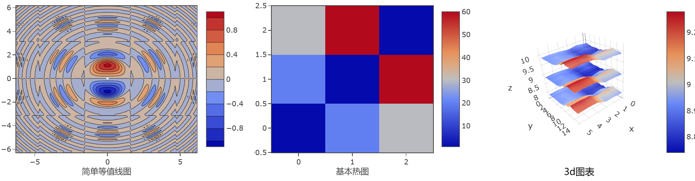

### 何时使用
建立在d3.js和stack.gl，Plotly.js是一个高级的声明性图表库。
- 快速使用plotly.js 提供的 40 多种图表类型，包括 3D 图表、统计图表和 SVG 地图;
- 当有大量的基本、统计、科学、财务、地图、3d和动画数据图表需要展现时。

### 代码演示
:::danger 危险
Errantia 组件不包含 **plotly.js** 任何库和包的内容, 使用**plotly.js** 能力需要提前在自己项目引入**plotly.js**, 不然Plot 图表绘制组件将无法正常工作,引入方式参考[ploty官网](https://plotly.com/javascript/getting-started/).
:::
#### 基本与统计图表

<details>
  <summary>代码</summary>
  ```html
  <template>
    <erFlex>
      <div style="width: 400px; height: 300px;">
        <erPlot 
          :dataSource="data"
          :layout="layout"
        />
      </div>
      <div style="width: 500px; height: 300px;">
        <erPlot
          :dataSource="data1"
          :xaxis="{title: '折线和散点图', zeroline: true, showline: true, mirror: false }"
          :yaxis="{zeroline: true, showline: true, mirror: false}"
          :margin="{b: 40}"
        />
      </div>
      <div style="width: 400px; height: 300px;">
        <erPlot
          :dataSource="data2"
          :layout="layout2"
          :margin="{l: 40}"
        />
      </div>
    </erFlex>
  </template>
  <script setup lang="ts">
    // 柱状图数据区域
    const data = [
      {
        x: ['1月', '2月', '3月', '4月', '5月', '6月', '7月', '8月', '9月', '10月', '11月', '12月'],
        y: [20, 14, 25, 16, 18, 22, 19, 15, 12, 16, 14, 17],
        type: 'bar',
        name: '产品1',
        marker: {
          color: 'rgb(49,130,189)',
          opacity: 0.7,
        }
      },
      {
        x: ['1月', '2月', '3月', '4月', '5月', '6月', '7月', '8月', '9月', '10月', '11月', '12月'],
        y: [19, 14, 22, 14, 16, 19, 15, 14, 10, 12, 12, 16],
        type: 'bar',
        name: '产品2',
        marker: {
          color: 'rgb(204,204,204)',
          opacity: 0.5
        }
      }
    ];
    const layout = {
      xaxis: {
        title: '柱状图',
        tickangle: -45
      },
      margin: {
        l: 40,
        r: 10,
        b: 50,
        t: 10,
      },
      barmode: 'group'
    };
    // 折线与散点数据区域
    const data1 = [
      {
        x: [1, 2, 3, 4],
        y: [10, 15, 13, 17],
        mode: 'markers',
        type: 'scatter'
      }, 
      {
        x: [2, 3, 4, 5],
        y: [16, 5, 11, 9],
        mode: 'lines',
        type: 'scatter'
      }, 
      {
        x: [1, 2, 3, 4],
        y: [12, 9, 15, 12],
        mode: 'lines+markers',
        type: 'scatter'
      }
    ];
    // 箱型图数据区域
    const y = [
      'day 1', 'day 1', 'day 1', 'day 1', 'day 1', 'day 1',
      'day 2', 'day 2', 'day 2', 'day 2', 'day 2', 'day 2'
    ]
    const data2 = [
      {
        x: [0.2, 0.2, 0.6, 1.0, 0.5, 0.4, 0.2, 0.7, 0.9, 0.1, 0.5, 0.3],
        y: y,
        name: 'kale',
        marker: {color: '#3D9970'},
        type: 'box',
        boxmean: false,
        orientation: 'h'
      }, 
      {
        x: [0.6, 0.7, 0.3, 0.6, 0.0, 0.5, 0.7, 0.9, 0.5, 0.8, 0.7, 0.2],
        y: y,
        name: 'radishes',
        marker: {color: '#FF4136'},
        type: 'box',
        boxmean: false,
        orientation: 'h'
      }, 
      {
        x: [0.1, 0.3, 0.1, 0.9, 0.6, 0.6, 0.9, 1.0, 0.3, 0.6, 0.8, 0.5],
        y: y,
        name: 'carrots',
        marker: {color: '#FF851B'},
        type: 'box',
        boxmean: false,
        orientation: 'h'
      }
    ];
    const layout2 = {
      xaxis: {
        title: '分组水平箱形图',
        zeroline: false,
        showline: false,
      },
      yaxis: {
        zeroline: true, 
        showline: true, 
        mirror: false
      },
      boxmode: 'group',
      showlegend: false,
    };
  </script>
  ```
</details>

#### 科学与3D图表

<details>
  <summary>代码</summary>
  ```html
  <template>
    <erFlex>
      <div style="width: 450px; height: 300px;">
        <erPlot 
          :dataSource="data"
          :xaxis="{title: '简单等值线图'}"
          :margin="{b: 40, l:30}"
        />
      </div>
      <div style="width: 400px; height: 300px;">
        <erPlot
          :dataSource="[{
              z: [[1, 20, 30], [20, 1, 60], [30, 60, 1]],
              type: 'heatmap'
          }]"
          :xaxis="{title: '基本热图' }"
          :margin="{l: 30, b: 40}"
        />
      </div>
      <div style="width: 400px; height: 300px;">
        <erPlot
          :dataSource="data2"
          :margin="{l: 40, b: 30}"
        />
        <div style="margin-left: 140px; margin-top: -18px; position: fixed;">3d图表</div>
      </div>
    </erFlex>
  </template>
  <script setup lang="ts">
    // 等线数据区域
    const size = 100;
    let x = new Array(size);
    let y = new Array(size);
    let z = new Array(size);
    let i = undefined;
    let j = undefined;
    for(i = 0; i < size; i++) {
      x[i] = y[i] = -2 * Math.PI + 4 * Math.PI * i / size;
        z[i] = new Array(size);
    }
    for(i = 0; i < size; i++) {
        for(j = 0; j < size; j++) {
          var r2 = x[i]*x[i] + y[j]*y[j];
          z[i][j] = Math.sin(x[i]) * Math.cos(y[j]) * Math.sin(r2) / Math.log(r2+1);
      }
    }
    const data = [{
        z: z,
        x: x,
        y: y,
        type: 'contour'
      }
    ];
    // 3D数据区域
    const z1 = [
        [8.83,8.89,8.81,8.87,8.9,8.87],
        [8.89,8.94,8.85,8.94,8.96,8.92],
        [8.84,8.9,8.82,8.92,8.93,8.91],
        [8.79,8.85,8.79,8.9,8.94,8.92],
        [8.79,8.88,8.81,8.9,8.95,8.92],
        [8.8,8.82,8.78,8.91,8.94,8.92],
        [8.75,8.78,8.77,8.91,8.95,8.92],
        [8.8,8.8,8.77,8.91,8.95,8.94],
        [8.74,8.81,8.76,8.93,8.98,8.99],
        [8.89,8.99,8.92,9.1,9.13,9.11],
        [8.97,8.97,8.91,9.09,9.11,9.11],
        [9.04,9.08,9.05,9.25,9.28,9.27],
        [9,9.01,9,9.2,9.23,9.2],
        [8.99,8.99,8.98,9.18,9.2,9.19],
        [8.93,8.97,8.97,9.18,9.2,9.18]
    ];
    const z2 = [];
    const z3 = []
    {
      let i = undefined;
      let j = undefined;
      for (i=0;i<z1.length;i++ ) { 
        let z2_row = [];
          for(j=0;j<z1[i].length;j++) { 
            z2_row.push(z1[i][j]+1);
          }
          z2.push(z2_row);
      }
      for ( i=0;i<z1.length;i++ ) { 
        let z3_row = [];
          for( j=0;j<z1[i].length;j++) { 
            z3_row.push(z1[i][j]-1);
          }
          z3.push(z3_row);
      }
    }
    const data_z1 = {z: z1, type: 'surface'};
    const data_z2 = {z: z2, showscale: false, opacity:0.9, type: 'surface'};
    const data_z3 = {z: z3, showscale: false, opacity:0.9, type: 'surface'};
    const data2 = [data_z1, data_z2, data_z3];
  </script>
  ```
</details>

### API
### Attributes
|属性名|说明|类型|默认值|
|:------|:------|:------|:------|
|dataSource|要绘制图表横纵坐标的数据源|any[],参考[plotly.data](https://plotly.com/javascript/reference/)|`{x: [1, 2, 3, 4], y: [2, 4, 3, 5], type: 'scatter', mode: 'lines+points' }`|
|layout|绘图的布局（与数据无关的视觉属性，如标题、注释等）在通常称为 的对象中描述|object, 参考[plotly.layout](https://plotly.com/javascript/reference/layout/)|`{xaxis: {zeroline: false,showline: true, mirror: true},yaxis: {zeroline: false,showline: true,mirror: true},showlegend: true,margin: {l: 10,r: 10,b: 30,t: 10},modebar: {remove: ["resetScale2d","toImage"]}}`|
|config|绘图的高级配置选项（例如滚动/缩放/悬停行为）在通常称为 的对象中描述|object,参考[plotly.config](https://plotly.com/javascript/configuration-options/)|`{ responsive: true,scrollZoom: true,}`|
|xaxis|二位坐标的横轴配置项|Object|—|
|yaxis|二位坐标的纵轴配置项|Object|—|
|margin|图表布局距离上下左右间距配置|Object|—|
