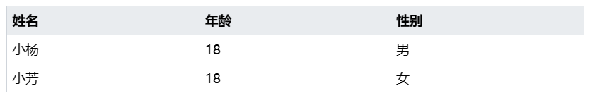
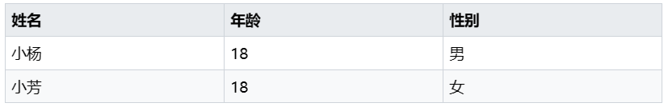
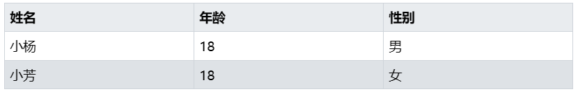
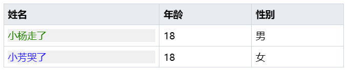
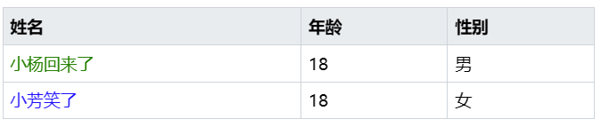

### 何时使用
- 展示行列数据;
- 当有大量结构化的数据需要展现时。

### 代码演示
#### 基础使用

<details>
  <summary>代码</summary>
  ```html
  <template>
    <erTable 
      :columns="columns"
      :dataSource="dataSource"
    />
  </template>
  <script setup lang="ts">
    import { ref } from 'vue'
    const columns = ref([
        {
          title: '姓名',
          key: 'name',
        },
        {
          title: '年龄',
          key: 'age',
        },
        {
          title: '性别',
          key: 'sex',
        }
    ])
    const dataSource = ref([
      {
        name: '小杨',
        age: 18,
        sex: '男'
      },
      {
        name: '小芳',
        age: 18,
        sex: '女'
      },
    ])
  </script>
  ```
</details>

#### 带边框的表格

<details>
  <summary>代码</summary>
  ```html
  <template>
    <erTable borders />
  </template>
  ```
</details>

#### 可选中行的表格

<details>
  <summary>代码</summary>
  ```html
  <template>
    <erTable 
      borders
      activeClickRow
    />
  </template>
  ```
</details>

#### render函数方式自定义单元格内容

<details>
  <summary>代码</summary>
  ```html
  <template>
    <erTable 
      borders
      activeClickRow
      :columns="columns"
      :dataSource="dataSource"
    />
  </template>
    <script setup lang="ts">
    import { ref } from 'vue'
    const columns = ref([
        {
          title: '姓名',
          key: 'name',
          render(h: any, { row, column, index }: any, ctx: any) {
            if(row.name === '小杨') {
              return h('div', {
                style: {
                  color: 'green',
                  backgroundColor: '#f0f0f0',
                },
                onclick: () => {
                  console.log(row, column, index, ctx)
                }
              }, `${row.name}走了`)
            }
            return h('div',{
              style: {
                color: 'blue',
                backgroundColor: '#f0f0f0',
              },
              onclick: () => {
                console.log(row, column, index, ctx)
              }
            }, `${row.name}哭了`)
          },
        },
        {
          title: '年龄',
          key: 'age',
        },
        {
          title: '性别',
          key: 'sex',
        }
    ])
    const dataSource = ref([
      {
        name: '小杨',
        age: 18,
        sex: '男'
      },
      {
        name: '小芳',
        age: 18,
        sex: '女'
      },
    ])
  </script>
  ```
</details>

:::tip 提示
建议了解vue3的[函数组件](https://v3-migration.vuejs.org/zh/breaking-changes/functional-components.html),再上手使用render函数配置方式,相同的场景你同样可以使用下面`插槽`的方式实现.
:::

#### Slot插槽方式自定义单元格内容

<details>
  <summary>代码</summary>
  ```html
  <template>
   <erTable
      borders
      :columns="columns"
      :dataSource="dataSource"
      @onClickRow="console.log('click', $event)"
      @onContextMenuRow="console.log('contextmenu', $event)"
      @onDbClickRow="(e, row, index, col, colIdx) => console.log('dbclick', e, row, index, col, colIdx)"
    >
      <template v-slot:name="{ row }">
        <div style="color: green;" v-if="row.name === '小杨'">{{ row.name }}回来了</div>
        <div style="color: blue;" v-else>{{ row.name }}笑了</div>
      </template>
    </erTable>
  </template>
  <script setup lang="ts">
    import { ref } from 'vue'
    const columns = ref([
        {
          title: '姓名',
          key: 'name',
          slot: 'name',
        },
        {
          title: '年龄',
          key: 'age',
        },
        {
          title: '性别',
          key: 'sex',
        }
    ])
    const dataSource = ref([
      {
        name: '小杨',
        age: 18,
        sex: '男'
      },
      {
        name: '小芳',
        age: 18,
        sex: '女'
      },
    ])
  </script>
  ```
</details>

### API
### Attributes
|属性名|说明|类型|默认值|
|:------|:------|:------|:------|
|borders|是否带有纵向边框|boolean|false|
|activeClickRow|是否可点击选中行|boolean|false|
|columns|表格列的配置描述，具体项见下表|ColumnsItem[]|`[{title: '姓名',key: 'name'},{title: '年龄',key: 'age'},{title: '性别',key: 'sex'}]`|
|dataSource|表数据|Object|`[{name: '小杨',age: 18,sex: '男'},{name: '小芳',age: 18,sex: '女']`|
|outStyleTable|自定义table元素样式|Object|—|
|outStyleHeader|自定义表头内容元素样式|Object|—|
|outStyleTh|自定义表头单元格元素样式|Object|—|
|outStyleRow|自定义表内容行元素样式|Object|—|
|outStyleRowTd|自定义表内容单元格元素样式|Object|—|

### Column
列描述数据对象，是 columns 中的一项，Column 使用相同的 API。
|属性名|说明|类型|默认值|
|:------|:------|:------|:------|
|title|显示的标题|string|—|
|key|column 的 key，默认展示数据时,`dataSource`对应列的值属性名必须和key相同|`string or number`|—|
|width|对应列的宽度|number|—|
|render|函数组件自定义渲染列内容|Function|—|
|slot|自定义列渲染插槽|Function|—|

### Events
|事件名|说明|类型|
|:------|:------|:------|
|@onClickRow|当某一行被点击时会触发该事件|Function|
|@onContextMenuRow|当某一行被鼠标右键点击时会触发该事件|Function|
|@onDbClickRow|当某个单元格被双击击时会触发该事件|Function|

:::info 信息
`@onClickRow`与`@onContextMenuRow`会对外暴露`$Event`、`row`和`index`三个参数;`@onDbClickRow`多出 `clo`与 `cloIdx`两个参数.  
- `$Event` 事件源
- `row` 当前行数据
- `index` 行索引
- `clo` 当前列数据
- `cloIdx` 列索引
:::
