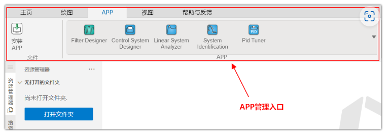
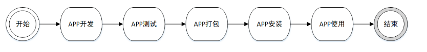

## APP 构建
APP 是带交互界面的应用程序，提供面向特定场景的专业应用，如控制系统设计与分析应用。APP 通常依赖函数库或模型库，具备 GUI 实现交互入口，通过专业算法调用底层函数。APP 作为专业工具，需要在 Syslab 平台的基础计算能力上，构建面向特定应用的专业计算能力。
## APP 管理
Syslab 提供 APP 管理功能，支持安装、启动、编辑、卸载 APP 等功能，APP 管理入口位于工具栏 Ribbon 的 APP 菜单页。
### APP 管理入口
Syslab 新增 APP 管理入口，位于工具栏 Ribbon 的 APP 菜单页，提供 APP 管理的快捷操作。位置如下图：

### APP 开发运行流程
APP的开发运行流程如下图所示。
