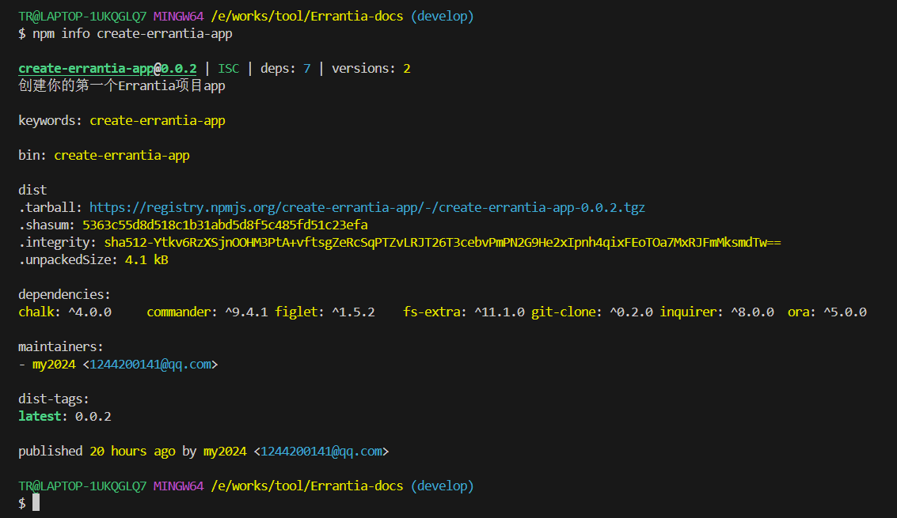
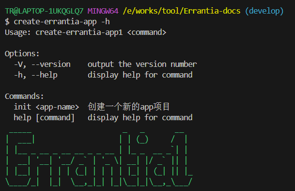
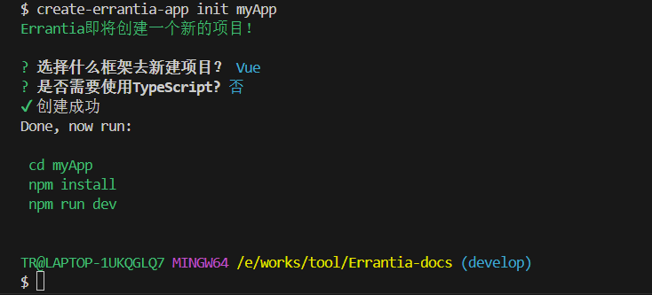
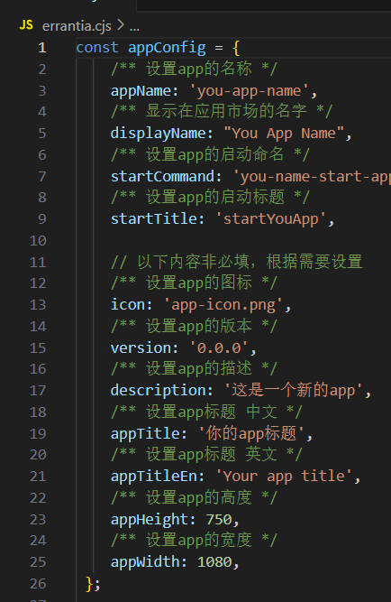
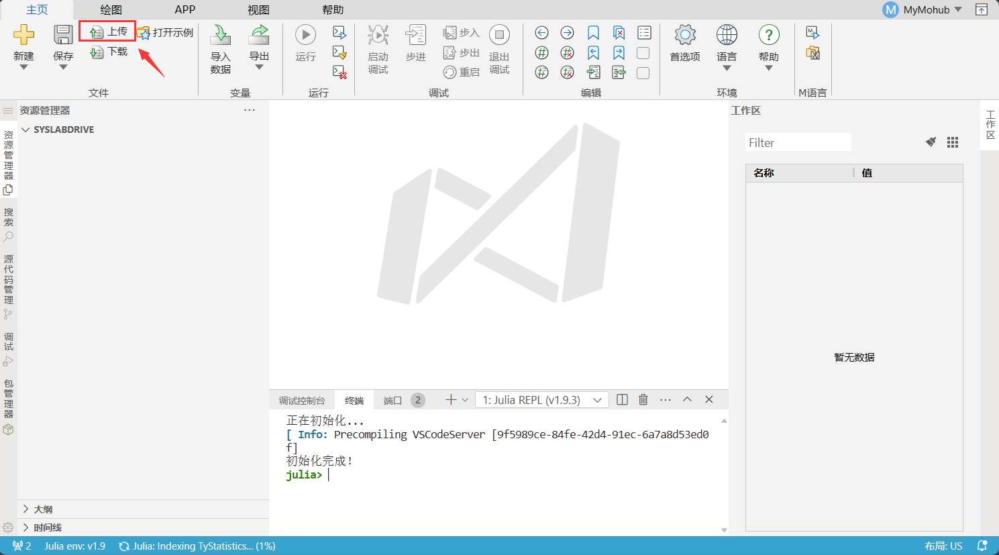
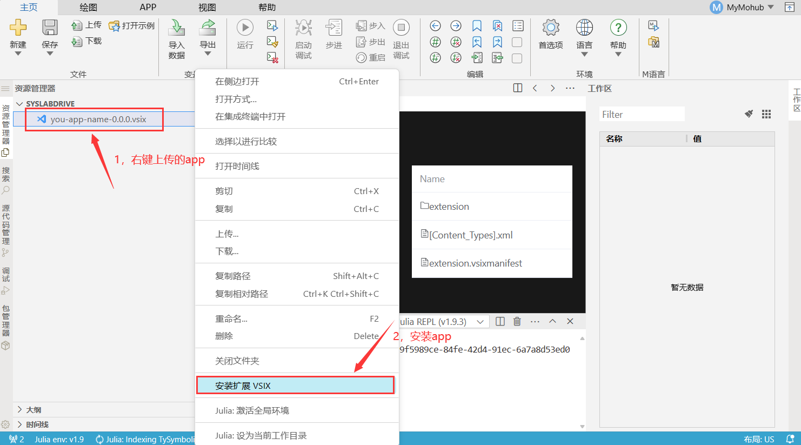
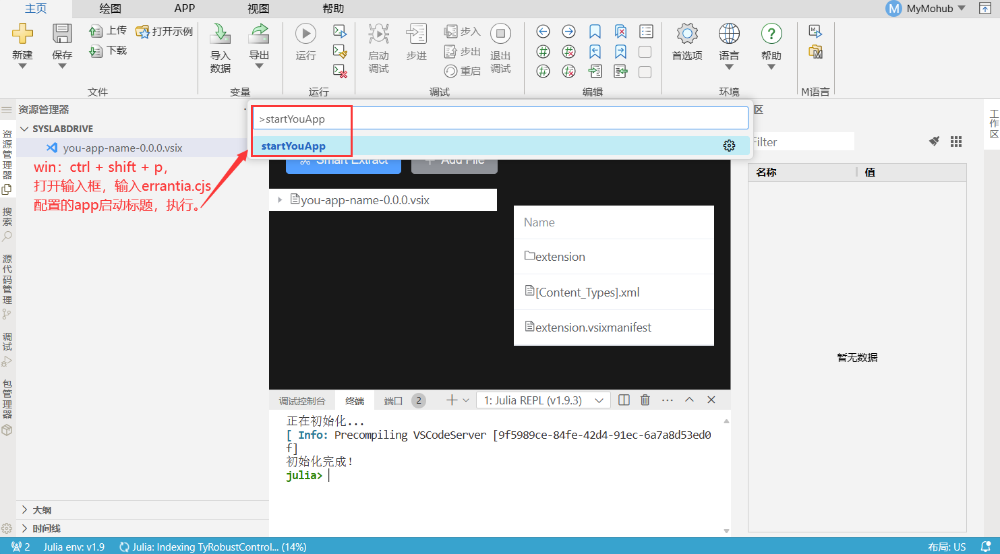
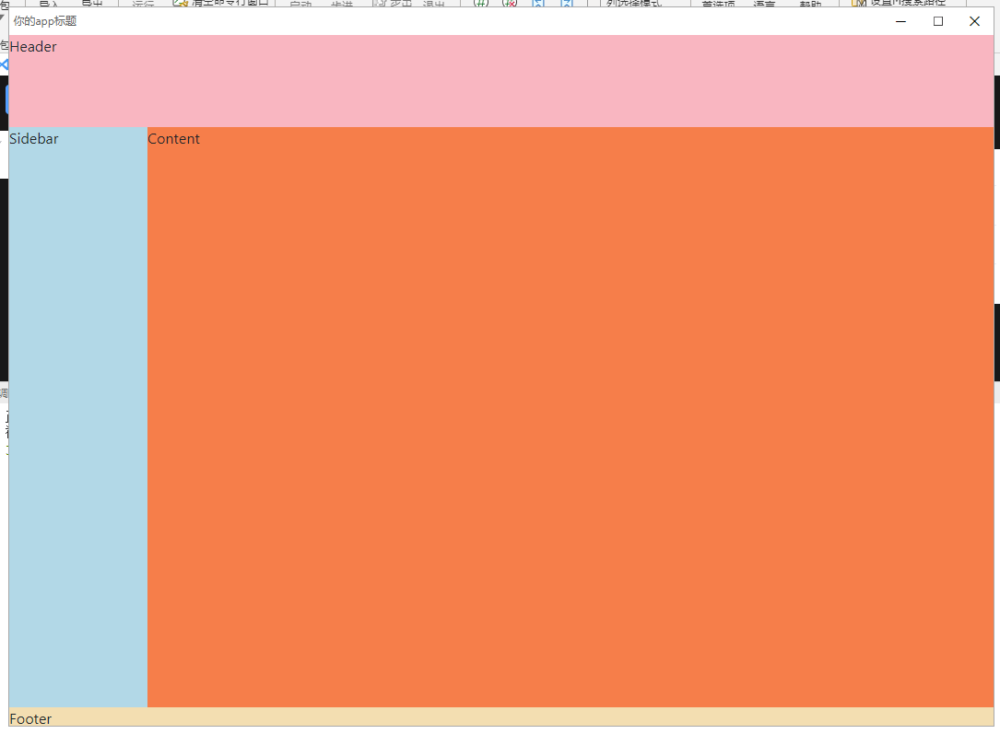

## 安装
Errantia 项目基于 node，请确保已具备较新的 node 环境（>=16.20.0），推荐使用 node 版本管理工具 nvm 来管理 node，这样不仅可以很方便地切换 node 版本，而且全局安装时候也不用加 sudo 了。

### CLI工具安装
首先，你需要使用 npm 或者 yarn 全局安装create-errantia-app，或者直接使用 npx:
```bash
# 选择一个你喜欢的包管理器

# 使用 npm 安装 CLI
$ npm install -g create-errantia-app

# OR 使用 yarn 安装 CLI
$ yarn global add create-errantia-app

# OR 安装了 cnpm，使用 cnpm 安装 CLI
$ cnpm install -g create-errantia-app
``` 
#### 查看Errantia全部版本信息
可以使用 npm info 查看 Errantia 版本信息，在这里你可以看到当前最新版本
```bash
$ npm info create-errantia-app
```

由图第 1 行可知最新版本，如果你用的是 beta 或者 canary 你可以通过 dist-tags: 下面那行看到最新的版本。
#### 查看Errantia帮助命令
```bash
$ create-errantia-app -h
```


## 项目初始化
使用命令创建模板项目：
```bash
$ create-errantia-app init myApp
```
  
这时候你可以在项目目录下进行依赖安装与开发
```js
# 进入项目根目录
$ cd myApp

# 使用 yarn 安装依赖
$ yarn

# OR 使用 npm 安装依赖
$ npm install

# OR 使用 pnpm 安装依赖
$ pnpm install

# OR 使用 cnpm 安装依赖
$ cnpm install
```
## 编译运行
使用 Errantia 的模板项目你只需要进行正常的web网站开发与查看效果，然后通过配置好的命令打包在对应的平台使用。
### Web 应用
#### 编译命令
``` bash
# yarn
$ yarn dev
$ yarn build

# or npm script
$ npm run dev
$ npm run build
```
想必你已经发现，web应用的开发与传统的[Vue](https://vuejs.org/)/[React](https://react.dev/)开发方式完全相同，在此不再详述。
### Syslab App 应用
Syslab App的应用的开发是在Web应用开发基础上，我们额外支持了与Syslab进行通信交互的[Api](../../api/about/apiExplain)和将Web build 的打包结果转换为Syslab App的能力。  
因此你完全不用担心Syslab App开发会带来额外的工作，相反你能直接将已有Web应用转换为Syslab App。
#### 编译命令
``` bash
# 同Web一样
# yarn
$ yarn dev
$ yarn build

# or npm script
$ npm run dev
$ npm run build
```
#### 转换为 Syslab App 命令
1. step1: 配置你的 Syslab App 应用信息    
      
   同步配置到package.json
   ```bash
   $ yarn updata-package
   ```
2. step2: 使用 `vsce` 打包你的应用为`.vsix`文件  
  全局安装vsce命令
   ```bash
   # 使用 npm 安装
   $ npm install -g vsce

   # OR 使用 yarn 安装
   $ yarn global add vsce
   ```
   运行打包命名
   ```bash
    $ vsce package
   ```
    :::tip 提示
    运行`vsce package` 前请确保你的项目**dist**文件夹已经存在且内容最新，否则请先执行`yarn build`或其它打包命令。
    :::
#### Syslab 查看 App
1. step1：打开Syslab Online版本
2. step2：上传`.vsix` app文件
  
3. step3：安装`.vsix` app文件为app
 
4. step4：运行App
 
5. step5: 查看效果
 
:::tip 提示
业界用户我们搭建了专属的[MoHub](https://mohub.net/home)平台供大家上传验证应用。
使用方法：
1. 打开[MoHub](https://mohub.net/home)
2. 注册或登录
3. 下拉选择`工作台`
  
4. 点击`打开SysLab Online`
  
:::

## 渐进式入门教程
我们提供了一个由浅入深的实战教程，请参考[《教程》](../../case/wave/testApp)。


